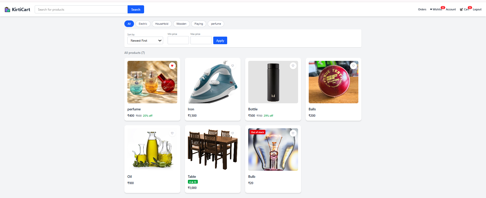
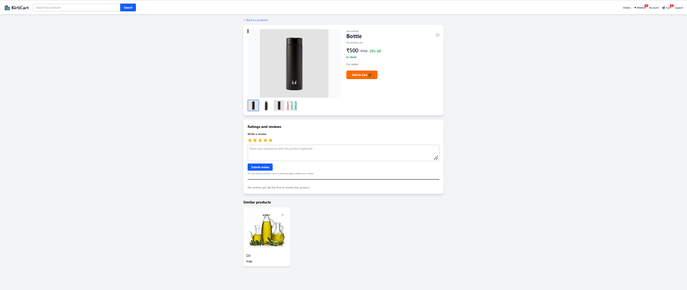
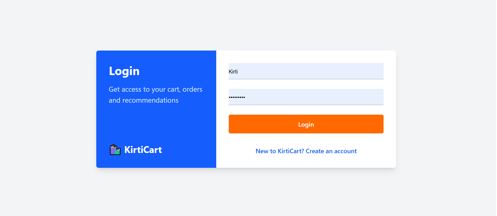
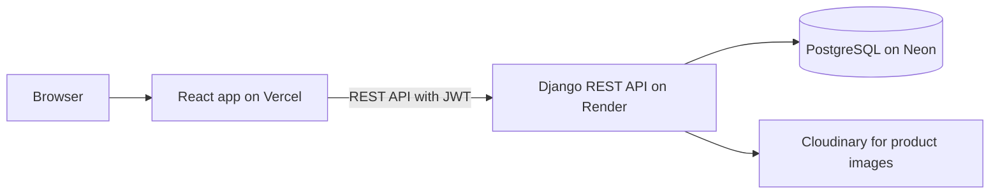

# KirtiCart

A full-stack e-commerce website built with **Django REST Framework** and **React**. Customers can browse products, search and filter, manage a cart, save addresses, place Cash on Delivery orders, track order status and write reviews.

**Live demo:** https://ecommerce-project-five-snowy.vercel.app
**API docs (Swagger):** https://ecommerce-project-camg.onrender.com/api/docs/

> The backend runs on a free hosting plan, so the first request after some idle time can take up to a minute while the server wakes up.

## Screenshots

**Home**



**Product page**



**Login**



## Features

- **Accounts:** sign up, login with JWT, automatic token refresh, login-first flow
- **Catalog:** search, category filter, price filter, sorting, pagination (all stored in the URL)
- **Product page:** image gallery, MRP and discount percentage, stock status, ratings and reviews, similar products
- **Cart:** stock-aware quantities, per-user carts
- **Checkout:** saved delivery addresses, coupons (percentage or flat, minimum order, max discount, usage limit), Cash on Delivery
- **Orders:** order history, status timeline (Placed, Confirmed, Shipped, Delivered), cancel with automatic stock restore
- **Wishlist** and **admin panel** (manage products, stock, orders and coupons)

## Tech stack

| Layer | Technology |
|---|---|
| Frontend | React (Vite), React Router, Tailwind CSS |
| Backend | Django, Django REST Framework, SimpleJWT, drf-spectacular |
| Database | PostgreSQL (Neon) |
| Media | Cloudinary |
| Hosting | Vercel (frontend), Render (backend) |
| Quality | Django tests, GitHub Actions CI |

## Architecture



## Main API endpoints

Full interactive list: `/api/docs/`

| Method | Endpoint | Purpose |
|---|---|---|
| POST | `/api/register/`, `/api/token/` | Sign up, login |
| GET | `/api/products/?search=&category=&min_price=&max_price=&ordering=&page=` | Product list |
| GET | `/api/products/<id>/`, `/similar/`, `/reviews/` | Product details |
| GET, POST | `/api/cart/`, `/api/cart/add/`, `/update/`, `/remove/` | Cart |
| GET, POST | `/api/addresses/` | Saved addresses |
| POST | `/api/coupons/apply/` | Check a coupon |
| POST | `/api/orders/create/` | Place an order |
| GET | `/api/orders/`, `/api/orders/<id>/` | Order history |
| POST | `/api/orders/<id>/cancel/` | Cancel an order |
| GET, POST | `/api/wishlist/`, `/api/wishlist/toggle/` | Wishlist |

## Design decisions

- **Prices and discounts are calculated on the server.** The browser only sends product ids, an address id and a coupon code.
- **Overselling is prevented.** Checkout locks the product rows (`select_for_update`) inside a database transaction, so two buyers cannot take the last item together.
- **Users only see their own data.** Cart items, orders and addresses are filtered by the logged-in user, which is covered by tests.
- **No N+1 queries** on the product list (`select_related`, `prefetch_related`, annotated ratings).
- **Orders keep a copy of the delivery address and prices**, so later edits do not change old orders.
- **Short-lived access tokens** (60 minutes) with a refresh token; the frontend refreshes them automatically.

## Run locally

Requirements: Python 3.12+, Node.js 20+, PostgreSQL.

**Backend** (from the project root)

```powershell
cd backend
python -m venv ..\venv
..\venv\Scripts\Activate.ps1
pip install -r requirements.txt
copy .env.example .env      # then edit the database values
python manage.py migrate
python manage.py createsuperuser
python manage.py runserver
```

**Frontend** (open a second terminal, from the project root)

```powershell
cd frontend
npm install
copy .env.example .env
npm run dev
```

Open http://localhost:5173. The admin panel is at http://127.0.0.1:8000/admin/.

## Environment variables

| Variable | Where | Purpose |
|---|---|---|
| `SECRET_KEY`, `DEBUG`, `ALLOWED_HOSTS` | backend | Django settings |
| `DB_NAME`, `DB_USER`, `DB_PASSWORD`, `DB_HOST`, `DB_PORT`, `DB_SSLMODE` | backend | PostgreSQL connection |
| `CLOUDINARY_URL` | backend (optional) | Product images in Cloudinary |
| `CORS_ORIGINS`, `CSRF_ORIGINS` | backend | Allowed frontend addresses |
| `VITE_DJANGO_BASE_URL` | frontend | Backend address |

## Tests

```powershell
cd backend
python manage.py test
```

The tests cover login, filters and pagination, cart and stock rules, orders, coupons, reviews, wishlist, addresses and data privacy between users. They also run on every push through GitHub Actions.

## Future improvements

- Online payments (Razorpay) with payment webhooks
- Order confirmation emails through a proper background queue (basic Brevo support already exists in the code)
- Caching for the product list